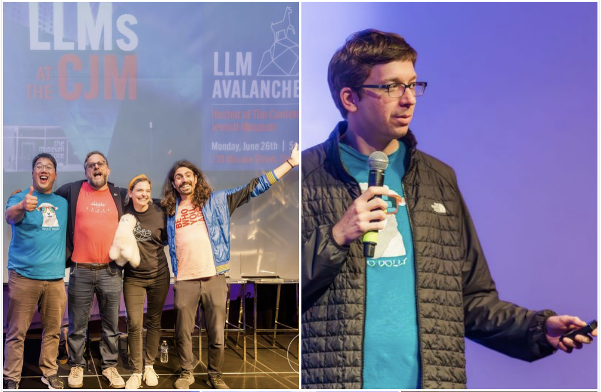
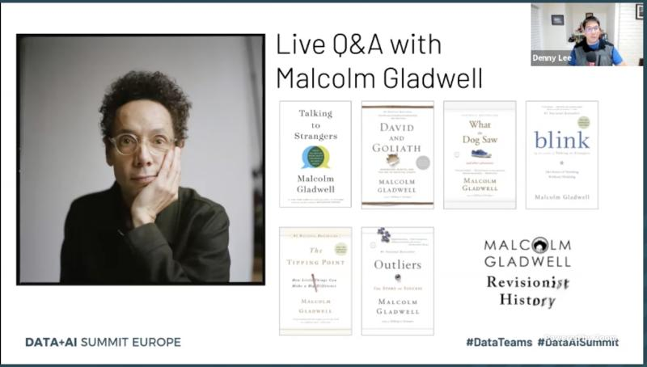

Hi there, my name is [Denny Lee](https://www.linkedin.com/in/dennyglee/) and I am developer advocate at Databricks, long-time contributor to Apache Spark™ and MLflow, [Delta Lake](https://delta.io) maintainer, [LLM Avalanche](https://llmavalanche.com) creator, [Data Brew by Databricks](https://data-brew.io) caster ([Spotify](https://open.spotify.com/show/0MqnE51Ym4HDx1oB7ztb4e), [Apple Podcasts](https://podcasts.apple.com/us/podcast/data-brew-by-databricks/id1538088814), [YouTube](https://www.youtube.com/@databrewbydatabricks/)). and long-time Seattle-ite.  In my past life, I was part of Microsoft Engineering for SQL Server, Cosmos DB, Bing, and part of the Project Isotope incubation team that brought Apache Hadoop into Microsoft.  

<table width="90%" cellpadding=0 cellspacing=5 border=0>
<tr>
<td width="33%"></td>
<td width="33%"></td>
<td width="33%"></td>
</tr>
</table>

> Here are my some of my presentations and videos at [YT @dennyglee](https://www.youtube.com/@dennyglee); I'm also (co-)author of the following [books](https://www.amazon.com/author/dennylee) including [Delta Lake: The Definitive Guide (Early Release)](https://www.oreilly.com/library/view/delta-lake-the/9781098151935/), [Learning Spark, 2nd Edition](https://www.oreilly.com/library/view/learning-spark-2nd/9781492050032/). If you're interested in posts in foodie and cycling posts, check out my [personal blog](https://dennyglee.com).

I am the (co-)author of the following posts, links, and assets are in reverse chronlogical order.  Some posts were originally on my wordpress site but have been moved over to GitHub, blemishes and all, for posterity.

> This blog is inspired by [Frank McSherry's musings](https://github.com/frankmcsherry/blog) which I highly recommend you follow especially if you're a fan of [Rust](https://www.rust-lang.org) like I am
>  

| date | topics | source | description |
| ---- | ------ | ------ | ----------- |
| 2023/08/25 | Spark, Delta |  | [Why Structured Streaming and Delta Lake for Batch ETL?](https://dennyglee.com/2023/08/25/why-structured-streaming-and-delta-lake-for-batch-etl/) |
| 2023/07/27 | LLMs | | [Quick Start with llama.cpp with Llama 2 and Macbook M2 Air](https://github.com/dennyglee/blog/blob/main/posts/2023-07-27.md) |
| 2023/06/29 | LLMs, Spark | Databricks | [Introducing English as the New Programming Language for Apache Spark](https://www.databricks.com/blog/introducing-english-new-programming-language-apache-spark) | 
| 2023/06/29 | Delta Lake | Databricks | [Announcing Delta Lake 3.0 with New Universal Format and Liquid Clustering](https://www.databricks.com/blog/announcing-delta-lake-30-new-universal-format-and-liquid-clustering) | 
| 2023/06/26 | LLMs | site | [LLM Avalanche](https://www.avalanche.fm): Over 40 speakers and 900 people attended this LLM conference-within-a-conference to kick start Data + AI Summit 2023 | 
| 2023/03/20 | Spark, Delta | | [Why does altering a Delta Lake table schema not show up in the Spark DataFrame?](https://dennyglee.com/2023/03/20/why-does-altering-a-delta-lake-table-schema-not-show-up-in-the-spark-dataframe/) |
| 2022/12/13 | Delta Lake | delta.io | [Building a more efficient data infrastructure for machine learning with Open Source using Delta Lake, Amazon SageMaker, and EMR](https://delta.io/blog/2022-12-13-sagemaker-emr-delta-lake/) |
| 2022/11/10 | community | Integration Developer News | [How Developers Can Manage and Contribute to Successful Open-Source Projects](https://www.idevnews.com/stories/7546/How-Developers-Can-Manage-and-Contribute-to-Successful-Open-Source-Projects) | 
| 2022/08/11 | Delta Lake | delta.io | [Apache Flink Source Connector for Delta Lake tables](https://delta.io/blog/2022-08-11-apache-flink-source-connector-for-delta-lake-tables/) |
| 2022/08/02 | Delta Lake | delta.io | [Delta 2.0 - The Foundation of your Data Lakehouse is Open](https://delta.io/blog/2022-08-02-delta-2-0-the-foundation-of-your-data-lake-is-open/) | 
| 2022/06/15 | Databricks | Databricks | [Defining the Future of Data & AI: Announcing the Finalists for the 2022 Databricks Data Team OSS Award](https://www.databricks.com/blog/2022/06/15/defining-the-future-of-data-ai-announcing-the-finalists-for-the-2022-databricks-data-team-oss-award.html) | 
| 2022/05/18 | Delta Lake | delta.io | [Multi-cluster writes to Delta Lake Storage in S3](https://delta.io/blog/2022-05-18-multi-cluster-writes-to-delta-lake-storage-in-s3/) |
| 2022/05/05 | Delta Lake | delta.io | [Delta Lake 1.2 - More Speed, Efficiency and Extensibility Than Ever](https://delta.io/blog/2022-05-05-delta-lake-1-2-released/) |
| 2022/04/27 | Delta Lake | delta.io | [Writing to Delta Lake from Apache Flink](https://delta.io/blog/2022-04-27-writing-to-delta-lake-from-apache-flink/) | 
| 2022/03/24 | Delta Lake, Trino | Starburst | [Starburst and Databricks Collaborate on the Trino Delta Lake Connector](https://www.starburst.io/blog/starburst-and-databricks-collaborate-on-the-trino-delta-lake-connector/) | 
| 2022/03/16 | Delta Lake | Databricks | [Extending Delta Sharing to Google Cloud Storage](https://www.databricks.com/blog/2022/03/16/extending-delta-sharing-to-google-cloud-storage.html) |  
| 2022/03/12 | Delta Lake, PrestoDB | PrestoDB | [Native Delta Lake Connector for Presto](https://prestodb.io/blog/2022/03/15/native-delta-lake-connector-for-presto) | 
| 2022/01/31 | Delta Lake | Databricks | [Make Your Data Lakehouse Run, Faster With Delta Lake 1.1](https://www.databricks.com/blog/2022/01/31/make-your-data-lakehouse-run-faster-with-delta-lake-1-1.html) | 
| 2022/01/28 | Delta Lake | Databricks | [The Ubiquity of Delta Standalone: Java, Scala, Hive, Presto, Trino, Power BI, and More!](https://www.databricks.com/blog/2022/01/28/the-ubiquity-of-delta-standalone-java-scala-hive-presto-trino-power-bi-and-more.html) | 
| 2022/01/21 | Delta Lake | Databricks | [Extending Delta Sharing for Azure](https://www.databricks.com/blog/2022/01/21/delta-sharing-release-0-3-0.html) | 
| 2021/12/01 | Delta Lake | Databricks | [The Foundation of Your Lakehouse Starts With Delta Lake](https://www.databricks.com/blog/2021/12/01/the-foundation-of-your-lakehouse-starts-with-delta-lake.html) |
| 2021/04/23 | podcasts | Databricks | [How We Launched a Podcast: Lessons, (Minor) Mishaps & Key Takeaways](https://www.databricks.com/blog/2021/04/23/how-we-launched-a-podcast-lessons-minor-mishaps-key-takeaways.html) |
| 2021/04/21 | Delta Lake | Databricks | [Attack of the Delta Clones (Against Disaster Recovery Availability Complexity)](https://www.databricks.com/blog/2021/04/20/attack-of-the-delta-clones-against-disaster-recovery-availability-complexity.html) |
| 2021/02/10 | Delta Lake | Databricks | [Automatically Evolve Your Nested Column Schema, Stream From a Delta Table Version, and Check Your Constraints](https://www.databricks.com/blog/2021/02/10/automatically-evolve-your-nested-column-schema-stream-from-a-delta-table-version-and-check-your-constraints.html) |  
| 2020/12/22 | Delta Lake | Databricks | [Natively Query Your Delta Lake With Scala, Java, and Python](https://www.databricks.com/blog/2020/12/22/natively-query-your-delta-lake-with-scala-java-and-python.html) | 
| 2020/11/20 | Delta Lake | Databricks | [How Scribd Uses Delta Lake to Enable the World's Largest Digital Library](https://www.databricks.com/blog/2020/11/20/how-scribd-uses-delta-lake-to-enable-the-worlds-largest-digital-library.html) | 
| 2020/09/29 | Delta Lake | Databricks | [Diving Into Delta Lake: DML Internals (Update, Delete, Merge)](https://www.databricks.com/blog/2020/09/29/diving-into-delta-lake-dml-internals-update-delete-merge.html) | 
| 2020/08/27 | Delta Lake | Databricks | [Enabling Spark SQL DDL and DML in Delta Lake on Apache Spark 3.0](https://www.databricks.com/blog/2020/08/27/enabling-spark-sql-ddl-and-dml-in-delta-lake-on-apache-spark-3-0.html) | 
| 2020/06/18 | Delta Lake | Databricks | [Time Traveling with Delta Lake: A Retrospective of the Last Year](https://www.databricks.com/blog/2020/06/18/time-traveling-with-delta-lake-a-retrospective-of-the-last-year.html) | 
| 2020/05/19 | Delta Lake | Databricks | [Schema Evolution in Merge Operations and Operational Metrics in Delta Lake](https://www.databricks.com/blog/2020/05/19/schema-evolution-in-merge-operations-and-operational-metrics-in-delta-lake.html) | 
| 2020/04/14 | health | Databricks | [COVID-19 Datasets Now Available on Databricks: How the Data Community Can Help](https://www.databricks.com/blog/2020/04/14/covid-19-datasets-now-available-on-databricks.html) | 
| 2020/01/29 | Delta Lake | Databricks | [Query Delta Lake Tables from Presto and Athena, Improved Operations Concurrency, and Merge performance](https://www.databricks.com/blog/2020/01/29/query-delta-lake-tables-presto-athena-improved-operations-concurrency-merge-performance.html) | 
| 2019/11/05 | ML | Databricks | [Using AutoML Toolkit's FamilyRunner Pipeline APIs to Simplify and Automate Loan Default Predictions](https://www.databricks.com/blog/2019/11/05/using-automl-toolkits-familyrunner-pipeline-apis-to-simplify-and-automate-loan-default-predictions.html) | 
| 2019/10/03 | Delta Lake | Databricks | [Simple, Reliable Upserts and Deletes on Delta Lake Tables using Python APIs](https://www.databricks.com/blog/2019/10/03/simple-reliable-upserts-and-deletes-on-delta-lake-tables-using-python-apis.html) | 
| 2019/09/24 | Delta Lake | Databricks | [Diving Into Delta Lake: Schema Enforcement & Evolution](https://www.databricks.com/blog/2019/09/24/diving-into-delta-lake-schema-enforcement-evolution.html) | 
| 2019/09/10 | ML | Databricks | [Using AutoML Toolkit to Automate Loan Default Predictions](https://www.databricks.com/blog/2019/09/10/using-automl-toolkit-to-automate-loan-default-predictions.html) | 
| 2019/08/21 | Delta Lake | Databricks | [Diving Into Delta Lake: Unpacking The Transaction Log](https://www.databricks.com/blog/2019/08/21/diving-into-delta-lake-unpacking-the-transaction-log.html) | 
| 2019/08/14 | Delta Lake, ML | Databricks | [Productionizing Machine Learning with Delta Lake](https://www.databricks.com/blog/2019/08/14/productionizing-machine-learning-with-delta-lake.html) | 
| 2019/06/18 | Delta Lake, Streaming | Databricks | [Simplifying Streaming Stock Analysis using Delta Lake and Apache Spark: On-Demand Webinar and FAQ Now Available!](https://www.databricks.com/blog/2019/06/18/simplifying-streaming-stock-analysis-using-delta-lake-and-apache-spark-on-demand-webinar-and-faq-now-available.html) | 
| 2019/05/02 | ML | Databricks | [Detecting Financial Fraud at Scale with Decision Trees and MLflow on Databricks](https://www.databricks.com/blog/2019/05/02/detecting-financial-fraud-at-scale-with-decision-trees-and-mlflow-on-databricks.html) | 
| 2019/04/30 | ML, MLflow | Databricks | [Using Dynamic Time Warping and MLflow to Detect Sales Trends](https://www.databricks.com/blog/2019/04/30/using-dynamic-time-warping-and-mlflow-to-detect-sales-trends.html) | 
| 2019/04/30 | ML, MLflow | Databricks | [Understanding Dynamic Time Warping](https://www.databricks.com/blog/2019/04/30/understanding-dynamic-time-warping.html) | 
| 2019/01/06 | ML, DL | dennyglee.com | [Deep Learning Fundamentals Series](https://dennyglee.com/2019/01/06/deep-learning-fundamentals-series/) | 
| 2018/11/13 | ML | Databricks | [Applying your Convolutional Neural Network: On-Demand Webinar and FAQ Now Available!](https://www.databricks.com/blog/2018/11/13/applying-your-convolutional-neural-network-on-demand-webinar-and-faq-now-available.html) | 
| 2018/10/29 | Delta  | Databricks | [Simplifying Change Data Capture with Databricks Delta](https://www.databricks.com/blog/2018/10/29/simplifying-change-data-capture-with-databricks-delta.html) |  
| 2018/10/22 | ML | Databricks | [Training your Neural Network: On-Demand Webinar and FAQ Now Available!](https://www.databricks.com/blog/2018/10/22/training-your-neural-network-on-demand-webinar-and-faq-now-available.html) | 
| 2018/10/03 | ML, MLflow | Databricks | [MLflow v0.7.0 Features New R API by RStudio](https://www.databricks.com/blog/2018/10/03/mlflow-v0-7-0-features-new-r-api-by-rstudio.html) | 
| 2018/10/01 | ML | Databricks | [Introduction to Neural Networks: On-Demand Webinar and FAQ Now Available!](https://www.databricks.com/blog/2018/10/01/introduction-to-neural-networks-on-demand-webinar-and-faq-now-available.html) | 
| 2018/09/18 | ML, Spark | Databricks | [Simplify Market Basket Analysis using FP-growth on Databricks](https://www.databricks.com/blog/2018/09/18/simplify-market-basket-analysis-using-fp-growth-on-databricks.html) | 
| 2018/09/13 | ML | Databricks | [Identify Suspicious Behavior in Video with Databricks Runtime for Machine Learning](https://www.databricks.com/blog/2018/09/13/identify-suspicious-behavior-in-video-with-databricks-runtime-for-machine-learning.html) | 
| 2018/09/12 | ML, MLflow | Databricks | [MLflow On-Demand Webinar and FAQ Now Available!](https://www.databricks.com/blog/2018/09/12/mlflow-on-demand-webinar-and-faq-now-available.html) | 
| 2018/09/09 | Delta Lake | Databricks | [Building a Real-Time Attribution Pipeline with Databricks Delta](https://www.databricks.com/blog/2018/08/09/building-a-real-time-attribution-pipeline-with-databricks-delta.html) | 
| 2018/09/09 | ML | Databricks | [Loan Risk Analysis with XGBoost and Databricks Runtime for Machine Learning](https://www.databricks.com/blog/2018/08/09/loan-risk-analysis-with-xgboost-and-databricks-runtime-for-machine-learning.html) | 
| 2018/08/08 | MLflow | Databricks | [MLflow 0.4.2 Released](https://www.databricks.com/blog/2018/08/08/mlflow-0-4-2-released.html) | 
| 2018/07/19 | Spark | Databricks | [Simplify Advertising Analytics Click Prediction with Databricks Unified Analytics Platform](https://www.databricks.com/blog/2018/07/19/simplify-advertising-analytics-click-prediction-with-databricks-unified-analytics-platform.html) | 
| 2018/07/19 | Spark, Delta | Databricks | [Simplify Streaming Stock Data Analysis Using Databricks Delta])(https://www.databricks.com/blog/2018/07/19/simplify-streaming-stock-data-analysis-using-databricks-delta.html) | 
| 2018/07/19 | Streaming, Spark, Delta | Databricks | [Make Your Oil and Gas Assets Smarter by Implementing Predictive Maintenance with Databricks](https://www.databricks.com/blog/2018/07/19/make-your-oil-and-gas-assets-smarter-by-implementing-predictive-maintenance-with-databricks.html) |
| 2018/07/09 | Spark | Databricks | [Analyze Games from European Soccer Leagues with Apache Spark and Databricks](https://www.databricks.com/blog/2018/07/09/analyze-games-from-european-soccer-leagues-with-apache-spark-and-databricks.html) |  
| 2018/07/02 | Spark, Streaming | Databricks | [Build a Mobile Gaming Events Data Pipeline with Databricks Delta](https://www.databricks.com/blog/2018/07/02/build-a-mobile-gaming-events-data-pipeline-with-databricks-delta.html) | 
| 2018/06/27 | R | Databricks | [Announcing RStudio and Databricks Integration](https://www.databricks.com/blog/2018/06/27/rstudio-integration.html) | 
| 2017/11/07 | CosmosDB | github | [Lambda Architecture with Azure Cosmos DB and HDInsight (Apache Spark)](https://github.com/dennyglee/azure-cosmosdb-spark/tree/master/samples/lambda) |
| 2017/08/04 | Spark | dennyglee.com | [Introduction to Apache Spark 2.0](https://dennyglee.com/2017/08/04/introduction-to-apache-spark-2-0/) | 
| 2017/02/18 | Spark | dennyglee.com | [Jump Start into Python and Apache Spark with Learning PySpark](https://dennyglee.com/2017/02/18/learning-pyspark/   ) | 
| 2016/12/02 | Spark | github | [How Apache Spark performs a fast count using the parquet metadata](https://github.com/dennyglee/databricks/blob/master/misc/parquet-count-metadata-explanation.md) | 
| 2016/06/30 | Spark | Databricks | [Introducing Getting Started with Apache Spark on Databricks](https://www.databricks.com/blog/2016/06/30/introducing-getting-started-with-apache-spark-on-databricks.html) | 
| 2016/06/22 | Spark | Databricks, KDNuggets | [Apache Spark Key Terms, Explained](https://www.databricks.com/blog/2016/06/22/apache-spark-key-terms-explained.html) | 
| 2016/06/08 | Spark | Databricks | [Another Record-Setting Spark Summit](https://www.databricks.com/blog/2016/06/08/another-record-setting-spark-summit.html) | 
| 2016/05/28 | Spark | dennyglee.com | [On-Time Flight Performance with GraphFrames for Apache Spark](https://dennyglee.com/2016/05/28/on-time-flight-performance-with-graphframes-for-apache-spark/) | 
| 2016/05/24 | Spark, Genomics | Databricks | [Predicting Geographic Population using Genome Variants and K-Means](https://www.databricks.com/blog/2016/05/24/predicting-geographic-population-using-genome-variants-and-k-means.html) |
| 2016/05/24 | Spark, Genomics | Databricks | [Parallelizing Genome Variant Analysis](https://www.databricks.com/blog/2016/05/24/parallelizing-genome-variant-analysis.html) |
| 2016/05/24 | Spark, Genomics | Databricks | [Genome Sequencing in a Nutshell](https://www.databricks.com/blog/2016/05/24/genome-sequencing-in-a-nutshell.html) |
| 2016/03/16 | Spark, Graph | Databricks | [On-Time Flight Performance with GraphFrames for Apache Spark](https://www.databricks.com/blog/2016/03/16/on-time-flight-performance-with-graphframes-for-apache-spark.html) | 
| 2016/02/11 | Spark, ML | InfoWorld | [Why you should use Spark for machine learning](https://www.infoworld.com/article/3031690/why-you-should-use-spark-for-machine-learning.html) |
| 2016/02/11 | Spark | dennyglee.com | [Presentation: Jump Start into Apache® Spark™ and Databricks](https://dennyglee.com/2016/02/11/presentation-jump-start-into-apache-spark-and-databricks/) | 
| 2016/02/02 | Spark | Databricks | [An Illustrated Guide to Advertising Analytics](https://www.databricks.com/blog/2016/02/02/an-illustrated-guide-to-advertising-analytics.html) | 
| 2016/01/05 | Spark | dennyglee.com | [Data Exploration with Databricks](https://dennyglee.com/2016/01/05/data-exploration-with-databricks/) |
| 2015/12/19 | community | Databricks | [Databricks launches Meetup-in-a-box for Apache Spark Meetup Organizers](https://www.databricks.com/blog/2015/11/19/databricks-launches-meetup-in-a-box-for-apache-spark-meetup-organizers.html) | 
| 2015/11/09 | Spark | insideBIGDATA | [Apache Spark is the Smartphone of Big Data](https://insidebigdata.com/2015/11/09/apache-spark-is-the-smartphone-of-big-data/) | 
| 2015/09/24 | Spark | Databricks | [Spark Survey 2015 Results are now available](https://www.databricks.com/blog/2015/09/24/spark-survey-2015-results-are-now-available.html) | 
| 2015/07/22 | ML | dennyglee.com | [Interested in career in Data Sciences? Read Freakonomics first!](https://dennyglee.com/2015/07/22/interested-in-career-in-data-sciences-read-freakonomics-first/) | 
| 2015/07/11 | DE | dennyglee.com | [Data Engineering Reading Materials: Spark, Machine Learning, and Distributed Systems Resources](https://dennyglee.com/2015/07/11/data-engineering-reading-materials-spark-machine-learning-and-distributed-systems-resources/) | 
| 2015/06/04 | Spark, ML | Databricks | [Simplify Machine Learning on Apache Spark with Databricks](https://www.databricks.com/blog/2015/06/04/simplify-machine-learning-on-spark-with-databricks.html) | 
| 2015/05/28 | Spark | dennyglee.com | [Notebook Gallery](https://dennyglee.com/2015/05/28/notebook-gallery/) |
| 2015/03/25 | Spark | dennyglee.com | [Spark Ecosystem & Spark Streaming Fundamentals](https://dennyglee.com/2015/03/25/spark-ecosystem-spark-streaming-fundamentals/) | 
| 2014/11/13 | Hive | dennyglee.com | [Quick Tip: Dropping Phantom Hive Databases (e.g. CDH5 Canary test dB)](https://dennyglee.com/2014/11/13/quick-tip-dropping-phantom-hive-databases-e-g-cdh5-canary-test-db/) | 
| 2014/10/16 | Spark | dennyglee.com | [Spark atop Mesos on Google Cloud Platform querying Google Cloud Storage](https://dennyglee.com/2014/10/16/spark-atop-mesos-on-google-cloud-platform-querying-google-cloud-storage/) | 
| 2014/05/24 | SSRS | dennyglee.com | [SQL Server Reporting Services Disaster Recovery Slides and Webinar](https://dennyglee.com/2014/05/25/sql-server-reporting-services-disaster-recovery-slides-and-webinar/) | 
| 2014/04/25 | Spark | dennyglee.com | [Learnings from Running Spark at Twitter](https://dennyglee.com/2014/04/25/learnings-from-running-spark-at-twitter/) | 
| 2014/03/04 | Spark | dennyglee.com | [Build your own CDH5 QuickStart VM with Spark on CentOS](https://dennyglee.com/2014/03/04/build-your-own-cdh5-quickstart-vm-with-spark-on-centos/) |
| 2014/02/16 | Spark | dennyglee.com | [Seattle Spark Meetup Kicks Off with DataBricks](https://dennyglee.com/2014/02/16/seattle-spark-meetup-kicks-off-with-databricks/) |
| 2014/02/11 | MySQL | dennyglee.com | [Quick Tips on Restoring a MySQL Full InnobackupEx Backup](https://dennyglee.com/2014/02/11/quick-tips-on-restoring-a-mysql-full-innobackupex-backup/) |
| 2014/01/06 | HDFS, pig | dennyglee.com | [Quick Tip for Compressing Many Small Text Files within HDFS via Pig](https://dennyglee.com/2014/01/06/quick-tip-for-compressing-many-small-text-files-within-hdfs-via-pig/) |
| 2013/12/27 | SQL, Hive | dennyglee.com | [Quick Tip for extracting SQL Server data to Hive](https://dennyglee.com/2013/12/27/quick-tip-for-extracting-sql-server-data-to-hive/) | 
| 2013/11/25 | Hive, WinOS | dennyglee.com | [Hive and Windows Auth – the curse of the backslash](https://dennyglee.com/2013/11/25/hive-and-windows-auth-the-curse-of-the-backslash/) | 
| 2013/11/02 | Hive | dennyglee.com | [Quick Tech Tip: SETting Cloudera Hue Beeswax to create a compressed Hive table](https://dennyglee.com/2013/11/02/quick-tech-tip-setting-cloudera-hue-beeswax-to-create-a-compressed-hive-table/) | 
| 2013/10/17 | WinOS, Ubuntu | dennyglee.com | [Lazy Geek Hack: Mismatch of Ubuntu and Microsoft Keyboards](https://dennyglee.com/2013/10/17/lazy-geek-hack-mismatch-of-ubuntu-and-microsoft-keyboards/) | 
| 2013/10/01 | | dennyglee.com | [Farewell Microsoft … Sometimes, you gotta roll the hard six!](https://dennyglee.com/2013/10/01/farewell-microsoft-sometimes-you-gotta-roll-the-hard-six/) | 
| 2013/09/30 | SSAS | dennyglee.com | [Analysis Services Multidimensional: It is the Order of Things](https://dennyglee.com/2013/09/30/analysis-services-multidimensional-it-is-the-order-of-things/) | 
| 2013/09/26 | SSRS | dennyglee.com | [SQL Server Reporting Services Disaster Recovery Case Study](https://dennyglee.com/2013/09/26/sql-server-reporting-services-disaster-recovery-case-study-3/) | 
| 2013/08/19 | Spark | dennyglee.com | [Why all this interest in Spark?](https://dennyglee.com/2013/08/19/why-all-this-interest-in-spark/) | 
| 2013/08/13 | SQL, SSAS, Hive | dennyglee.com | [Quick Tips and Q&A for SQL Server Analysis Services to Hive](https://dennyglee.com/2013/08/13/quick-tips-and-qa-for-sql-server-analysis-services-to-hive/) | 
| 2013/07/16 | Spark | dennyglee.com | [Jump Start onto Spark 0.7.2 and Scala 2.9.3 on Mac OSX](https://dennyglee.com/2013/07/16/jump-start-onto-spark-0-7-2-and-scala-2-9-3-on-mac-osx/) | 
| 2013/07/11 | Big Data, Healthcare | dennyglee.com | [Project “ChâteauKebob”: Big Data to BI End-to-End Healthcare Auditing Compliance](https://dennyglee.com/2013/07/11/project-chateaukebob/) | 
| 2013/06/05 | Kafka | dennyglee.com | [Jump Start on Apache Kafka 0.8 with Scala 2.9.2 on Mac OSX](https://dennyglee.com/2013/06/05/jump-start-on-apache-kafka-0-8-with-scala-2-9-2-on-mac-osx/) | 
| 2013/05/14 | random | dennyglee.com | [In the context of quantum entanglement and time travel – Stargate may be more correct than Star Trek](https://dennyglee.com/2013/05/14/in-the-context-of-quantum-entanglement-and-time-travel-stargate-may-be-more-correct-than-star-trek/) | 
| 2013/05/09 | Hive | dennyglee.com | [Compile and add Hive UDF via ADD JAR in HDInsight on Azure](https://dennyglee.com/2013/05/09/compile-and-add-hive-udf-via-add-jar-in-hdinsight-on-azure/) | 
| 2013/05/06 | Hive | dennyglee.com | [Add Built-In Hive UDFs on HDInsight Azure](https://dennyglee.com/2013/05/06/add-built-in-hive-udfs-on-hdinsight-azure/) | 
| 2013/04/26 | Hive | dennyglee.com | [Optimizing Joins running on HDInsight Hive on Azure at GFS](https://dennyglee.com/2013/04/26/optimizing-joins-running-on-hdinsight-hive-on-azure-at-gfs/) | 
| 2013/03/25 | Hadoop | dennyglee.com | [Updated HDInsight on Azure ASV paths for multiple storage accounts](https://dennyglee.com/2013/03/25/updated-hdinsight-on-azure-asv-paths-for-multiple-storage-accounts/) | 
| 2013/03/18 | blob | dennyglee.com | [Why use Blob Storage with HDInsight on Azure](https://dennyglee.com/2013/03/18/why-use-blob-storage-with-hdinsight-on-azure/) | 
| 2013/03/12 | Avro, Hadoop | dennyglee.com | [Using Avro with HDInsight on Azure at 343 Industries](https://dennyglee.com/2013/03/12/using-avro-with-hdinsight-on-azure-at-343-industries/) | 
| 2013/03/06 | Hadoop, protobuf | dennyglee.com | [Getting Hadoop and protobufs up and running with Elephant Bird on Mac OSX Mountain Lion](https://dennyglee.com/2013/03/06/getting-hadoop-and-protobufs-up-and-running-with-elephant-bird-on-mac-osx-mountain-lion/) | 
| 2013/02/04 | Spark | dennyglee.com | [Installing Spark 0.6.1 Standalone on OSX Mountain Lion (10.8)](https://dennyglee.com/2013/02/04/installing-spark-0-6-1-standalone-on-osx-mountain-lion-10-8/) |
| 2012/12/08 | Hadoop | dennyglee.com | [Yahoo! 24TB SSAS Big Data Case Study + Slides](https://dennyglee.com/2012/12/08/yahoo-24tb-ssas-big-data-case-study-slides/) |  
| 2012/12/03 | Hadoop, pig | dennyglee.com | [Getting your Pig to eat ASV blobs in Windows Azure HDInsight](https://dennyglee.com/2012/12/03/getting-your-pig-to-eat-asv-blobs-in-windows-azure-hdinsight/) | 
| 2012/11/07 | Hive | dennyglee.com | [An easy way to test out Hive Dynamic Partition Insert on HDInsight Azure](https://dennyglee.com/2012/11/07/an-easy-way-to-test-out-hive-dynamic-partition-insert-on-hdinsight-azure/) | 
| 2012/10/29 | Hadoop, S3 | dennyglee.com | [Oh where, oh where did my S3N go? (in Windows Azure HDInsight) Oh where, Oh where, can it be?!](https://dennyglee.com/2012/10/29/oh-where-oh-where-did-my-s3n-go-in-windows-azure-hdinsight-oh-where-oh-where-can-it-be/) |
| 2012/10/11 | Hive, ODBC | dennyglee.com | [HiveODBC error message “..expected data length is 334…”](https://dennyglee.com/2012/10/11/hiveodbc-error-message-expected-data-length-is-334/) |
| 2012/10/01 | SSRS | dennyglee.com | [Enterprise Reporting Services Jump Start Guide](https://dennyglee.com/2012/10/01/enterprise-reporting-services-jump-start-guide/) | 
| 2012/09/26 | SSAS, Hive | dennyglee.com | [SQL Server Analysis Services to Hive](https://dennyglee.com/2012/09/26/sql-server-analysis-services-to-hive/) | 
| 2012/09/06 | Hadoop | dennyglee.com | [Thursday TechTips: Hadoop 1.01 and Compression Codecs](https://dennyglee.com/2012/09/06/thursday-techtips-hadoop-1-01-and-compression-codecs/) | 
| 2012/09/03 | random | dennyglee.com | [In the context of quantum entanglement and teleportation – Stargate may be more correct than Star Trek](https://dennyglee.com/2012/09/03/in-the-context-of-quantum-entanglement-and-teleportation-stargate-may-be-more-correct-than-star-trek/) | 
| 2012/08/29 | Hbase | dennyglee.com | [A Quick HBase Primer from a SQLBI Perspective](https://dennyglee.com/2012/08/29/a-quick-hbase-primer-from-a-sqlbi-perspective/) | 
| 2012/07/24 | Power View | dennyglee.com | [Power View Tip: Scatter Chart over Time on the X-Axis and Play Axis](https://dennyglee.com/2012/07/24/power-view-tip-scatter-chart-over-time-on-the-x-axis-and-play-axis/) | 
| 2012/06/28 | SSAS | Microsoft | [Microsoft SQL Server Analysis Services Multidimensional Performance a n d Operations Guide](http://download.microsoft.com/download/0/F/B/0FBFAA46-2BFD-478F-8E56-7BF3C672DF9D/Microsoft%20SQL%20Server%20Analysis%20Services%20Multidimensional%20Performance%20and%20Operations%20Guide.pdf) | 
| 2012/05/08 | Hadoop | dennyglee.com | [Installing Hadoop on OSX Lion (10.7)](https://dennyglee.com/2012/05/08/installing-hadoop-on-osx-lion-10-7/) | 
| 2012/03/25 | MS-SQL | dennyglee.com | [How to Connect Report Builder 3.0 to a SQL Server 2012 PowerPivot workbook](https://dennyglee.com/2012/03/25/how-to-connect-report-builder-3-0-to-a-sql-server-2012-powerpivot-workbook/) | 
| 2012/03/21 | Hadoop, s3 | dennyglee.com | [Connecting Hadoop on Azure to your Amazon S3 Blob storage](https://dennyglee.com/2012/03/21/connecting-hadoop-on-azure-to-your-amazon-s3-blob-storage/) |
| 2012/03/01 | Hadoop, BI | dennyglee.com | [BI and Big Data–the best of both worlds!](https://dennyglee.com/2012/03/01/bi-and-big-datathe-best-of-both-worlds/) | 
| 2012/02/17 | Hadoop, JS | dennyglee.com | [Hadoop JavaScript– Microsoft’s VB shift for Big Data](https://dennyglee.com/2012/02/17/hadoop-javascript-microsofts-vb-shift-for-big-data/) | 
| 2012/01/31 | big data | dennyglee.com | [Moving data to compute or compute to data? That is the Big Data question](https://dennyglee.com/2012/01/31/moving-data-to-compute-or-compute-to-data-that-is-the-big-data-question/) | 
| 2012/01/24| big data | dennyglee.com | [Scale Up or Scale Out your Data Problems? A Space Analogy](https://dennyglee.com/2012/01/24/scale-up-or-scale-out-your-data-problems-a-space-analogy/) | 
| 2012/01/21 | PowerPivot, Hadoop | dennyglee.com | [Connecting PowerPivot to Hadoop on Azure – Self Service BI to Big Data in the Cloud](https://dennyglee.com/2012/01/21/connecting-powerpivot-to-hadoop-on-azure-self-service-bi-to-big-data-in-the-cloud/) |
| 2012/01/15 | Hadoop, Azure | dennyglee.com | [Hadoop on Azure: HiveQL query against Azure Blob Storage](https://dennyglee.com/2012/01/15/hadoop-on-azure-hiveql-query-against-azure-blob-storage/) | 
| 2012/01/15 | Hadoop, Azure | dennyglee.com | [Setup Azure Blob Store for Hadoop on Azure CTP](https://dennyglee.com/2012/01/15/setup-azure-blob-store-for-hadoop-on-azure-ctp/) | 
| 2012/01/12 | Hadoop, Azure | dennyglee.com | [A funky way to do Hive and Hadoop … on Azure](https://dennyglee.com/2012/01/12/a-funky-way-to-do-hive-and-hadoop-on-azure/) |
| 2011/12/15 | Hadoop, Azure | dennyglee.com | [An Azure Elephant Never Forgets…](https://dennyglee.com/2011/12/15/an-azure-elephant-never-forgets/) | 
| 2011/10/12 | Hadoop, SQL | dennyglee.com | [Revelations – rolling the hard six to SQL BI and Hadoop](https://dennyglee.com/2011/10/12/revelations-rolling-the-hard-six-to-sql-bi-and-hadoop/) | 
| 2011/10/01 | MS-SQL | Microsoft | [SQL Server 2008 R2: Analysis Services Performance Guide](https://download.microsoft.com/download/6/5/6/6567c845-fc8d-4d62-920f-c027a349c889/ssasperfguide2008r2.pdf) ([backup](https://github.com/dennyglee/dennyglee.github.io/blob/main/assets/whitepapers/ssasperfguide2008r2.pdf))|  
| 2011/07/22 | Hadoop | dennyglee.com | [Hadoop: A movement, not just a technology](https://dennyglee.com/2011/07/22/hadoop-a-movement-not-just-a-technology/) | 
| 2011/06/02 | big data | dennyglee.com | [The potential of Big Data](https://dennyglee.com/2011/06/02/the-potential-of-big-data/) | 
| 2011/05/23 | cloud | dennyglee.com | [Netflix rocks–from great entertainment to showcasing how to develop for the Cloud](https://dennyglee.com/2011/05/23/netflix-rocksfrom-great-entertainment-to-showcasing-how-to-develop-for-the-cloud/) | 
| 2011/05/17 | random | dennyglee.com | [At a Crossroads … from SSAS to BigData!](https://dennyglee.com/2011/05/17/at-a-crossroads-from-ssas-to-bigdata/) | 
| 2010/06/01 | MS-SQL | Microsoft | [Scale-Out Querying for Analysis Services with Read-Only Databases](https://download.microsoft.com/download/a/5/7/a575ad7c-4172-42d0-8d58-0698d6802f81/ssasreadonlydbs.docx) ([backup](https://github.com/dennyglee/dennyglee.github.io/blob/main/assets/whitepapers/ssasreadonlydbs.docx)) | 
| 2009/12/22 | Healthcare | book | [Transforming Health Care Through Information: Case Studies (Health Informatics)](https://www.amazon.com/Transforming-Health-Care-Through-Information/dp/1441902686/) |
| 2009/05/12 | MS-SQL | Microsoft | [Disk Partition Alignment Best Practices for SQL Server](https://learn.microsoft.com/en-us/previous-versions/sql/sql-server-2008/dd758814(v=sql.100)?redirectedfrom=MSDN) | 
| 2009/05/12 | MS-SQL | dennyglee.com | [Designing and Tuning for Performance your SSIS packages in the Enterprise (SQL Video Series)](https://dennyglee.com/2009/05/12/designing-and-tuning-for-performance-your-ssis-packages-in-the-enterprise-sql-video-series/) | 
| 2008/11/05 | MS-SQL | Microsoft | [Reaching Compliance: SQL Server 2008 Compliance Guide](https://download.microsoft.com/download/b/e/6/be6f02af-882e-4039-b737-8741e0c1b342/ReachingCompliance.docx) ([backup](https://github.com/dennyglee/dennyglee.github.io/blob/main/assets/whitepapers/ReachingCompliance.docx)) | 
| 2008/04/17 | MS-SQL | Microsoft | [Analysis Services Distinct Count Optimization](https://www.microsoft.com/en-us/download/details.aspx?id=891) ([backup](https://github.com/dennyglee/dennyglee.github.io/blob/main/assets/whitepapers/SSASDistinctCountOpt.docx))| 
| 2007/09/24 | Privacy | dennyglee.com | [Analyzing Data while Protecting Privacy – A Differential Privacy Case Study](https://dennyglee.com/2007/09/24/analyzing-data-while-protecting-privacy-a-case-study/) | 
| 2006/03/02 | Research | paper (acknowledgement) | [Early establishment of a pool of latently infected, resting CD4+ T cells during primary HIV-1 infection](https://www.pnas.org/doi/full/10.1073/pnas.95.15.8869) | 
| 2001/10/01 | MS-SQL | book | [Professional SQL Server 2000 Data Warehousing with Analysis Services](https://www.amazon.com/Professional-Server-Warehousing-Analysis-Services/dp/1861005407/ref=sr_1_1?crid=1RBBFEUWJ5R1O&keywords=978-1861005403&qid=1692988108&sprefix=978-1861005403%2Caps%2C135&sr=8-1&ufe=app_do%3Aamzn1.fos.18ed3cb5-28d5-4975-8bc7-93deae8f9840) |
