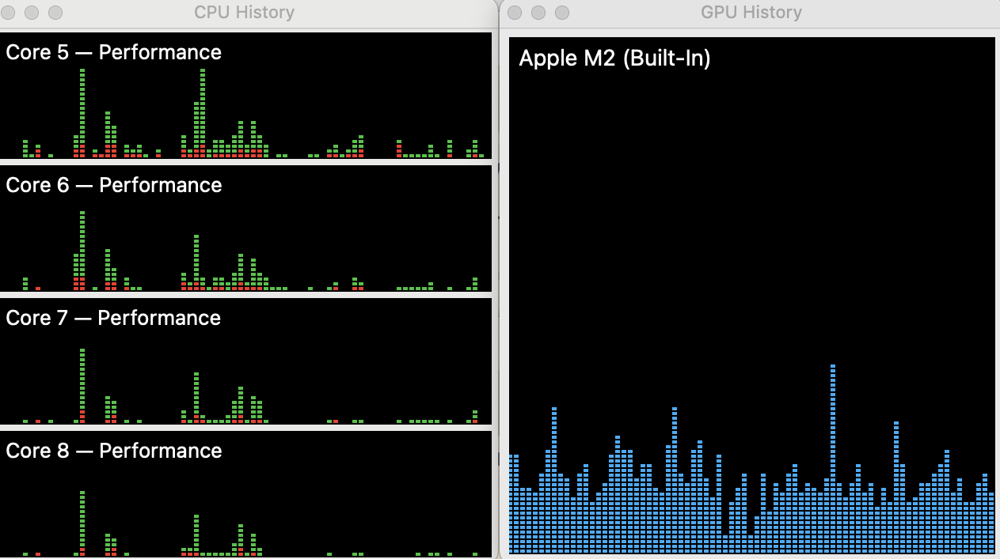

# Quick Start with llama.cpp with Llama 2 and Macbook M2 Air


> [Georgi Gergano](https://github.com/ggerganov) is the developer of `llama.cpp` and this post is inspired by this work.  You can review more of it at [llama.cpp](https://github.com/ggerganov/llama.cpp) and [llama:Metal inference #1642](https://github.com/ggerganov/llama.cpp/pull/1642)

Here is a quick guide on how to use `llama.cpp` with my Macbook M2 Air using Meta's [Llama 2](https://ai.meta.com/llama/) so I can test out LLMs making use of my M2 chip.   Most of the information is already available [llama.cpp](https://github.com/ggerganov/llama.cpp) but I've just extracted out the specific tasks for the M1/M2 chip.


**Overall tasks**
1. [Clone llama.cpp repo](#clone-llamacpp-repo)
1. [Request access and download Llama-2](#request-access-and-download-llama-2)
1. [Configure your CPU/GPU history via Activity monitor](#configure-your-cpugpu-history-via-activity-monitor)
1. [Convert and quantize LLAMA2 models](#convert-and-quantize-llama2-models) 
1. [Compile llama.cpp via LLAMA_METAL](#compile-llamacpp-via-llama_metal)
1. [Run inference](#run-inference)
1. [Have fun, but watch for hallucinations!](#have-fun-but-watch-for-hallucinations)


## Clone llama.cpp repo
As noted in the beginning, everything starts with [Georgi Gergano](https://github.com/ggerganov)'s [llama.cpp](https://github.com/ggerganov/llama.cpp) - so clone it!


## Request access and download Llama-2
Whether you run the download link from Meta or download the files from Huggingface, start by [requesting access](https://ai.meta.com/resources/models-and-libraries/llama-downloads/).  The process is relatively straightforward and in my case, took less than 24h to get approved.

> The Llama 2 GitHub has the latest information, refer to the [Llama 2 GitHub > Download](https://github.com/facebookresearch/llama#download).

Once approved, you can download the models from the [Llama 2 GitHub](https://github.com/facebookresearch/llama#download)  download the models, you can do so via [Hugging Face Meta Llama 2](https://huggingface.co/meta-llama).  

Whichever method you choose, download the models to the `llama.cpp/models` folder.  In the following example, I had downloaded the [7B](https://huggingface.co/llamaste/Llama-2-7b) and [13B](https://huggingface.co/meta-llama/Llama-2-13b) models from HuggingFace to `$~/github/llama.cpp/models`.  Running the `tree` command (`brew install tree` if you don't have it handy) has the following output.

```
% tree ./models

./models
├── 13B
│   ├── checklist.chk
│   ├── consolidated.00.pth
│   ├── consolidated.01.pth
│   ├── ggml-model-f32.bin
│   ├── params.json
│   ├── tokenizer.model
│   └── tokenizer_checklist.chk
├── 7B
│   ├── checklist.chk
│   ├── consolidated.00.pth
│   ├── ggml-model-f16.bin
│   ├── ggml-model-q4_0.bin
│   ├── params.json
│   ├── tokenizer.model
│   └── tokenizer_config.json
```

## Configure your CPU/GPU history via Activity Monitor
To validate the model inference is running on my M2 GPUs (instead of the CPUs), a handy way is to open your macOS Activity Monitor > Window > GPU History and Activity Monitor > Window > CPU History similar to the screenshot below.



> Note, I only included Cores 5-8 as they are the performance cores which would take the bulk of the load if using CPUs.


## Convert and quantize LLAMA2 models 
The instructions are almost verbatim of [Prepare Data and Run](https://github.com/ggerganov/llama.cpp#prepare-data--run) with small notes included.

### Install Python dependencies
Currently this installs both `numpy` and [`sentencepiece`](https://github.com/google/sentencepiece) which is an unsupervised text tokenizer and detokenizer mainly for Neural Network-based text generation systems where the vocabulary size is predetermined prior to the neural model training. 

```
# install Python dependencies
python3 -m pip install -r requirements.txt
```

### Convert models to ggml format
Per [GGML - Large Language Models for Everyone](https://github.com/rustformers/llm/blob/main/crates/ggml/README.md#ggml---large-language-models-for-everyone):

> [GGML](https://github.com/ggerganov/ggml) is a C library for machine learning (ML) - the "GG" refers to the initials of its originator ([Georgi Gerganov](https://ggerganov.com/)). In addition to defining low-level machine learning primitives (like a tensor type), GGML defines a binary format for distributing large language models (LLMs).

The following commands convert the Llama 2 7B and 13B PyTorch (`.pth`) model to `ggml` format. 

```
# convert the 7B model to ggml format
python3 convert.py models/7B/

# convert the 13B model to ggml format
python3 convert.py models/13B/
```

## Quantize the models
We quantize the models to reduce the computational and memory requirements of running inference against these models by representing the weights and activations with lower precision data types - in this case 4-bit (`int`) -  instead of higher precision data types such as 32-bit floating points (`float32`).  To perform this task, `llama.cpp` includes the `quantize` command:

```
# quantize the model to 4-bits (using q4_0 method)
./quantize ./models/7B/ggml-model-f16.bin ./models/7B/ggml-model-q4_0.bin q4_0
./quantize ./models/13B/ggml-model-f32.bin ./models/13B/ggml-model-q4_0.bin q4_0
```

For more information on the quantize concept, refer to:
- [Hugging Face Concept Guide > Quantization](https://huggingface.co/docs/optimum/concept_guides/quantization)
- [Making LLMs even more accessible with bitsandbytes, 4-bit quantization and QLoRA](https://huggingface.co/blog/4bit-transformers-bitsandbytes)

This [comment](https://github.com/ggerganov/llama.cpp/discussions/1121#discussioncomment-5693566) by [Folko-Ven](https://github.com/Folko-Ven) summarizes `q4_0` succinctly:

> You can see more about the different types of quantization here - [#406](https://github.com/ggerganov/llama.cpp/discussions/406). But in short, 
> - q4_0 - worse accuracy but higher speed, 
> - q4_1 - more accurate but slower. 
> - q4_2 and q4_3 are like new generations of q4_0 and q4_1. 
>    - q4_2 should be more accurate q4_0 and just as fast, and 
>    - q4_3 should be similarly more accurate than q4_1.


## Compile llama.cpp via LLAMA_METAL
We're almost there!  Naviage to the `llama.cpp` root folder and compile using `make`.  There are other [build](https://github.com/ggerganov/llama.cpp#build) options - this version is specific to Metal build using `make` so the computation will be executed on M1/M2 GPU.

```
make clean
LLAMA_METAL=1 make
```

> I added the `make clean` as I initially forgot to compile my code using `LLAMA_METAL=1` which meant I was only using my MBA CPUs.


## Run inference
The following is running inference using the 13B model on one of my favorite questions "What are the best techniques for great espresso". 

```
 ./main -m ./models/13B/ggml-model-q4_0.bin -p "What are the best techniques for great espresso" --ignore-eos -n 128 -ngl 1
```

Below is the abridged output:

```
main: build = 899 (41c6741)
main: seed  = 1690455760
llama.cpp: loading model from ./models/13B/ggml-model-q4_0.bin
llama_model_load_internal: format     = ggjt v3 (latest)
...
ggml_metal_init: allocating
ggml_metal_init: using MPS
ggml_metal_init: loading '/github/llama.cpp/ggml-metal.metal'
ggml_metal_init: loaded kernel_add                            0x150f07c40
...
ggml_metal_init: recommendedMaxWorkingSetSize = 10922.67 MB
ggml_metal_init: hasUnifiedMemory             = true
ggml_metal_init: maxTransferRate              = built-in GPU
llama_new_context_with_model: max tensor size =   128.17 MB
...
generate: n_ctx = 512, n_batch = 512, n_predict = 128, n_keep = 0


 What are the best techniques for great espresso?
There are many ways to make a good cup of coffee. But, there is only one way that will result in a delicious and consistent shot every time:
The right ratio of coffee grounds to water
Proper grind size
A proper water temperature
A proper water pressure (especially in the grouphead)
A long enough brew time
Let’s break down these 5 components so you can see why they are so important:
1. The right ratio of coffee grounds to water
There is no “right” answer here, because different types of coffee beans will require a slightly different amount
llama_print_timings:        load time =  1021.73 ms
llama_print_timings:      sample time =    84.38 ms /   128 runs   (    0.66 ms per token,  1516.97 tokens per second)
llama_print_timings: prompt eval time =  1434.96 ms /    11 tokens (  130.45 ms per token,     7.67 tokens per second)
llama_print_timings:        eval time = 12648.51 ms /   127 runs   (   99.59 ms per token,    10.04 tokens per second)
llama_print_timings:       total time = 14180.84 ms
ggml_metal_free: deallocating
```

Take particular note of the following:
- Use `-ngl 1` to configure llama.cpp to enable GPU inference (any value larger than 0 will offload to GPU) 
- `ggml_metal_init: using MPS` indicates that we're using the M2 GPU
- Using `-n 128` specifies the number of tokens (the higher the value, often the responses becomes more verbose)
- You can watch the comparison between 7B and 13B models via the animated gif in the beginning of this post.


## Have fun, but watch for hallucinations!
That's it, with these steps you should be able to run LLMs on your MBA thanks to  [llama.cpp](https://github.com/ggerganov/llama.cpp)!   Just a friendly reminder that LLMs can hallucinate such as when I asked the question *Which bagels are better, Montreal or New York?*:

`./main -m ./models/13B/ggml-model-q4_0.bin -p "Which bagels are better, Montreal or New York?" -n 512 -ngl 1 `


**Which bagels are better, Montreal or New York?**

Few things divide Americans and Canadians quite so much as this age-old question: Who makes the best bagels on Earth — Montreal or New York? Each city has long maintained its own take on the humble bread product, with the Big Apple claiming bagels have a crispier exterior than their Canadian counterparts.

    This is true

The great debate is now at hand, though. The Bagel Store, which was once one of Montreal’s most popular eateries, has made plans to open its first New York City outpost on West 17th Street, near Seventh Avenue South, in the Chelsea area. It will join the ranks of Montreal-style bagel joints already here such as H&H Bagels and Ess-A-Bagel (there are many others).

    There was no "The Bagel Store" in Montréal.  And while I personally prefer Montréal bagels ala St. Viateur and Fairmont bagels, H&H Bagels is the quintessential New York bagel and I am completely flabergasted that H&H Bagels could be seen as a Montreal-style bagel joint.

“What we found is that there’s a huge demand for our product in New York City,” said Richard Osteria, owner of The Bagel Store. “We want to expand outside of Montreal.”
The Bagel Store has four locations in the Canadian city and Mr. Osteria also owns a bagel store chain in Germany called Der Berliner — which may be an indication that he’s got a thing for authenticity, since the German capital is not known for its bagel prowess. 

    Wait, what?  Who is Richard?  Scot Rossillo was the owner of The Bagel Store in Brooklyn and invented "The Rainbow Bagel" and the shop was not in Montréal or any other Canadian city.  Berlin is known for many things - bagel prowess probably isn't one of them (though, I would be glad to have a Berliner correct me here)

...


So have fun, but for the sake of your bagels, watch for hallucinations!
